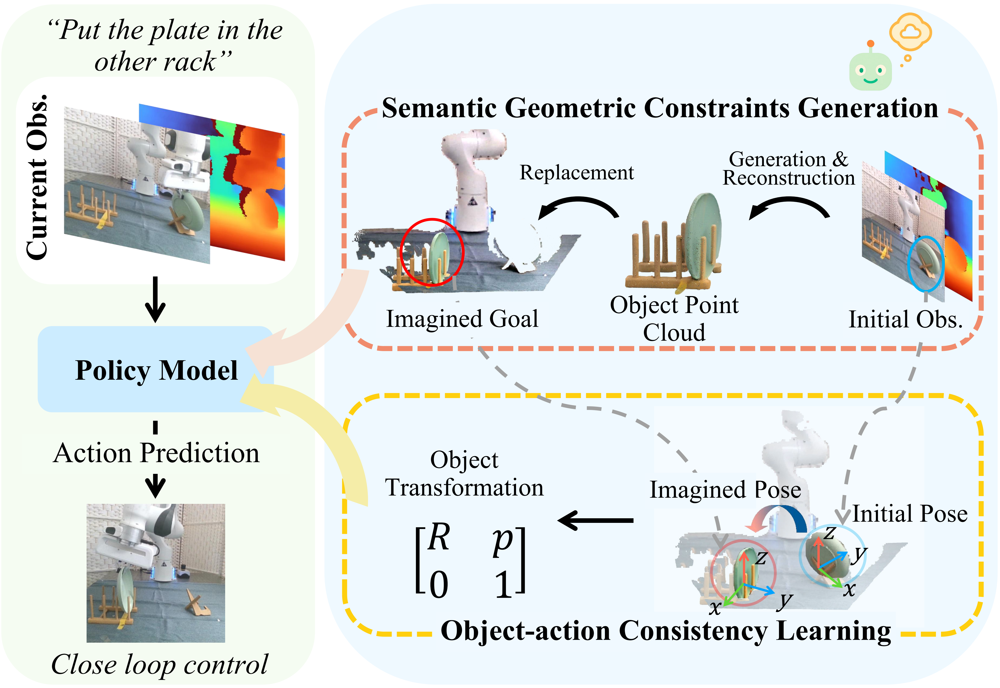

<h1 align="center">Imagine2Act: Leveraging Object-Action Motion Consistency from Imagined Goals for Robotic Manipulation</h1>
<!-- By [Tsung-Wei Ke*](https://twke18.github.io/), [Nikolaos Gkanatsios*](https://nickgkan.github.io/) and [Katerina Fragkiadaki](https://www.cs.cmu.edu/~katef/) -->

<p align="center">
  <a href="https://sites.google.com/view/imagine2act"></a>
  <a href="https://arxiv.org/abs/2509.17125"></a>
  <a href="https://github.com/LiangHeng121/Imagine2Act/issues"></a>
</p>

<!-- Official implementation of ["Imagine2Act: Leveraging Object-Action Motion Consistency from Imagined Goals for Robotic Manipulation"](https://arxiv.org/abs/2509.17125). -->

<!--  -->
<p align="center">
  
</p>

**Imagine2Act** is a 3D imitation learning framework that incorporates semantic and geometric object constraints into policy learning for high-precision manipulation. It generates imagined goal images conditioned on language instructions and reconstructs corresponding 3D point clouds as semantic–geometric priors for the policy. An object–action consistency strategy with soft pose supervision explicitly aligns predicted end-effector motions with generated object transformations, enabling accurate and consistent 3D action prediction across diverse tasks. Experiments in both simulation and the real world demonstrate that Imagine2Act outperforms previous state-of-the-art policies.


# Installation
Create a conda environment with the following command:

```
# initiate conda env
> conda update conda
> conda env create -f environment.yaml
> conda activate imagine2act

# install diffuser
> pip install diffusers["torch"]

# install dgl (https://www.dgl.ai/pages/start.html)
>  pip install dgl==1.1.3+cu116 -f https://data.dgl.ai/wheels/cu116/dgl-1.1.3%2Bcu116-cp38-cp38-manylinux1_x86_64.whl

# install flash attention (https://github.com/Dao-AILab/flash-attention#installation-and-features)
> pip install packaging
> pip install ninja
> pip install flash-attn==2.5.9.post1 --no-build-isolation
```

### Install RLBench
```
# Install open3D
> pip install open3d

# Install PyRep (https://github.com/stepjam/PyRep?tab=readme-ov-file#install)
> cd imagine2act
> git clone https://github.com/stepjam/PyRep.git 
> cd PyRep/
> wget https://www.coppeliarobotics.com/files/V4_1_0/CoppeliaSim_Edu_V4_1_0_Ubuntu20_04.tar.xz
> tar -xf CoppeliaSim_Edu_V4_1_0_Ubuntu20_04.tar.xz;
> echo "export COPPELIASIM_ROOT=$(pwd)/CoppeliaSim_Edu_V4_1_0_Ubuntu20_04" >> $HOME/.bashrc; 
> echo "export LD_LIBRARY_PATH=\$LD_LIBRARY_PATH:\$COPPELIASIM_ROOT" >> $HOME/.bashrc;
> echo "export QT_QPA_PLATFORM_PLUGIN_PATH=\$COPPELIASIM_ROOT" >> $HOME/.bashrc;
> source $HOME/.bashrc;
> conda activate 3d_diffuser_actor
> pip install -r requirements.txt; pip install -e .; cd ..

# Install RLBench (Note: there are different forks of RLBench)
# PerAct setup
> git clone https://github.com/LiangHeng121/RLBench.git
> cd RLBench; git checkout -b peract --track origin/peract; pip install -r requirements.txt; pip install -e .; cd ../..;
```

### Install GroundedSAM, FoundationPose, and TripoSR

We use three external modules for imagined goal generation, 3D reconstruction, and pose alignment.  
Each module should be installed in its own conda environment to avoid dependency conflicts.

| Module | Repository | Environment | Description |
|---------|-------------|-------------|--------------|
| **Grounded-Segment-Anything (GroundedSAM)** | [LiangHeng121/Grounded-Segment-Anything](https://github.com/LiangHeng121/Grounded-Segment-Anything) | `groundedsam` | 2D segmentation and text grounding |
| **FoundationPose** | [NVlabs/FoundationPose](https://github.com/NVlabs/FoundationPose) | `foundationpose` | 6D object pose estimation |
| **TripoSR** | [LiangHeng121/TripoSR](https://github.com/LiangHeng121/TripoSR) | `triposr` | 3D reconstruction from a single image |

Each can be installed following the official instructions in their repositories.  


# Data Preparation

## Prepare for testing episodes

Download the testing episodes from [(TODO: add link)](https://huggingface.co/your-dataset-link) repo. Extract the zip files to `./imagine2act/data/raw/test/`

## Prepare for training/validation episodes

Download the packaged training/validation demonstrations from [here](https://huggingface.co/datasets/heng222/imagine2act_dataset). Extract the zip file to `./imagine2act/data/packaged/`


## Optional: Generate Data from Scratch

If you want to generate your own high-resolution dataset with imagined goals and corresponding 3D object transformations, follow these steps:

**Step 0 – Generate base RLBench episodes**

Generate raw RLBench episodes and package them into `.dat` files for one or multiple tasks.

```bash
cd imagine2act
bash scripts/data_generation.sh <split> <task1> [task2] [task3] ...
# Example:
bash scripts/data_generation.sh train phone_on_base place_cups stack_cups
cd ..
```

**Step 1 – Image-to-3D Generation Pipeline**

Run the following command with your target task name (`phone_on_base`, `place_cups`, `put_knife_in_knife_block`, `put_plate_in_colored_dish_rack`, `put_toilet_roll_on_stand`, `stack_cups`, `stack_wine`):

```bash
bash pipeline.sh <task_name>
# Example:
bash pipeline.sh phone_on_base
```

**Step 2 – Scene Alignment and Fusion Pipeline**

Run the following command with your target task name and dataset split (`train`, `val`, or `test`):

```bash
bash pipeline_2.sh <task_name> <split>
# Example:
bash pipeline_2.sh phone_on_base train
```

**Step 3 – Merge into new packaged `.dat` files**

Combine the original packaged RLBench episodes with the imagined 3D goals and transformation annotations to produce new `.dat` files under `./imagine2act/data/packaged/{split}_imagine/`.

```bash
python ./utils/merge.py <task_name> <split>
# Example:
python ./utils/merge.py phone_on_base train
```


## Optional: Encode language instructions

You can encode RLBench task instructions using our CLIP-based script:

```bash
cd imagine2act
python ./data_preprocessing/preprocess_rlbench_instructions.py \
  --tasks phone_on_base place_cups put_knife_in_knife_block \
          put_plate_in_colored_dish_rack put_toilet_roll_on_stand \
          stack_cups stack_wine \
  --output instructions.pkl
```

# Getting started

## Train on RLBench

**Train Imagine2Act on RLBench**

```bash
cd imagine2act
bash scripts/train.sh
```

This script launches single-view training using our imagined goal representations and transformation supervision on all selected RLBench tasks.  
After training, checkpoints and logs will be saved under `./imagine2act/train_logs/`.

**Pretrained Models**  
You can also download our pretrained Imagine2Act models on RLBench from [here](https://drive.google.com/file/d/1ZBAWoSdizyQ5RQYB-YcicW9zfLcsLfgI/view?usp=sharing).

## Test on RLBench

To evaluate a trained or pretrained model, run:

```bash
cd imagine2act
bash scripts/eval.sh
```

The evaluation results, including success rates and visualizations, will be saved under `./imagine2act/eval_logs/`.

# Citation
If you find this code useful for your research, please consider citing our paper ["Imagine2Act: Leveraging Object-Action Motion Consistency from Imagined Goals for Robotic Manipulation"](https://arxiv.org/abs/2509.17125).
```
@misc{heng2025imagine2actleveragingobjectactionmotion,
      title={Imagine2Act: Leveraging Object-Action Motion Consistency from Imagined Goals for Robotic Manipulation}, 
      author={Liang Heng and Jiadong Xu and Yiwen Wang and Xiaoqi Li and Muhe Cai and Yan Shen and Juan Zhu and Guanghui Ren and Hao Dong},
      year={2025},
      eprint={2509.17125},
      archivePrefix={arXiv},
      primaryClass={cs.RO},
      url={https://arxiv.org/abs/2509.17125}, 
}
```

# License
This code base is released under the MIT License (refer to the LICENSE file for details).

# Acknowledgement
Parts of this codebase have been adapted from [3D Diffuser Actor](https://github.com/nickgkan/3d_diffuser_actor).


